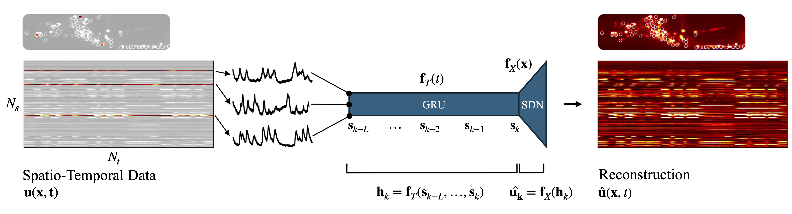

# Neural SHRED

This directory contains the implementation of the experiments presented in *Shallow Recurrent Decoders for Neural and　Behavioral Dynamics*

A *Shallow Recurrent Decoder* (SHRED) is composed of a *gated-recurrent unit* (GRU) that processes teporal dependency of sensor data and a *shallow decoder network* (SDN) that projects to the full state space. 

All experiments for the *C. elegans*, mouse, and zebrafish can be reconstructed using the `.ipynb` contained in this repository. The data for each model organism must be downloaded from the corresponding websites: 

- [*C.elegans*](https://osf.io/2395t/): Download WT_Stim.mat and copy file to `/neuralSHRED/worms/data`

- [Mouse](https://allensdk.readthedocs.io/en/latest/visual_coding_neuropixels.html): the `.ipynb` for the mouse sections (expB) should contain all the information required to obtain the mouse data. If the code is unclear, refer to the `quick start guide (download .ipynb)` link on the Visual Coding- Neuropixel project website for more in-depth instructions. 

- [Zebrafish](https://www.nature.com/articles/nmeth.2434) Download the `Neuronal activity in the forebrain` video located in the *Supplementary Information* section of the paper. Rename the movie to `forebrain.avi` and copy to `/neuralSHRED/zebra_fish/data`.

